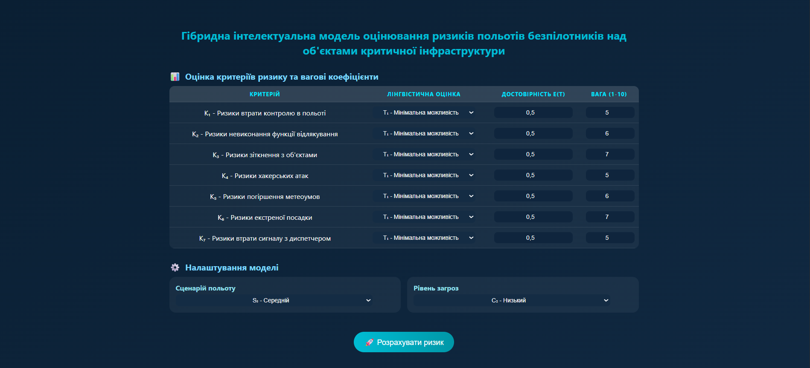

# 🛩️ Гібридна інтелектуальна модель оцінювання ризиків польотів UAV

[](https://romankozar.github.io/fuzzy-cybersecurity-assessment/)
[](https://github.com/RomanKozar/fuzzy-cybersecurity-assessment)
[](https://github.com/RomanKozar/fuzzy-cybersecurity-assessment/releases)



## 🎯 Призначення

Веб-додаток для оцінювання ризиків виконання польотів безпілотних літальних апаратів (UAV) над об’єктами критичної інфраструктури.
Система поєднує методи експертного аналізу та математичного моделювання для підвищення рівня безпеки польотів.
---

## ✨ Основні можливости

- ✅ Оцінка **8 критеріїв ризику** з використанням лінгвістичних змінних
- ⚙️ **Налаштування вагових коефіцієнтів** для кожного критерію
- 🔄 **4 сценарії оцінювання** — песимістичний, обережний, середній, оптимістичний
- 🧠 Врахування **додаткових висновків ОПР** (особи, що приймає рішення)
- 📊 **Візуалізація результатів** у вигляді кругового датчика та діаграми
- 📱 **Адаптивний дизайн** для різних пристроїв

---

## 🧩 Введення даних

### 🔹 Критерії ризику

| №   | Критерій                                             |
| --- | ---------------------------------------------------- |
| K₁  | Ризики втрати контролю в польоті                     |
| K₂  | Ризики невиконання функції відлякування диких звірів |
| K₃  | Ризики зіткнення з об’єктами аеропорту               |
| K₄  | Ризики, пов’язані з хакерськими атаками              |
| K₅  | Ризики різкого погіршення метеоумов                  |
| K₆  | Ризики, пов’язані з екстреною посадкою               |
| K₇  | Ризики втрати сигналу з диспетчером                  |
| K₈  | Додатковий критерій (опціонально)                    |

### 🔹 Для кожного критерію задається:

- **Лінгвістична оцінка (T)** — можливість настання ризику:
  - T₁ (0–20%) — мінімальна
  - T₂ (20–40%) — нижче середнього
  - T₃ (40–60%) — середня
  - T₄ (60–80%) — висока
  - T₅ (80–100%) — критична

- **Достовірність ε(T)** — впевненість експерта (0–1)

- **Вага (v)** — важливість критерію (1–10)

---

## ⚙️ Налаштування моделі

### 🔹 Сценарії польоту

| Позначення | Назва         | Метод               |
| ---------- | ------------- | ------------------- |
| S₁         | Песимістичний | Гармонічне середнє  |
| S₂         | Обережний     | Геометричне середнє |
| S₃         | Середній      | Арифметичне середнє |
| S₄         | Оптимістичний | Квадратичне середнє |

### 🔹 Рівень загроз (ОПР)

| Позначення | Рівень загроз | δ     |
| ---------- | ------------- | ----- |
| C₁         | Мінімальний   | 0.889 |
| C₂         | Низький       | 0.778 |
| C₃         | Середній      | 0.556 |
| C₄         | Високий       | 0.333 |
| C₅         | Максимальний  | 0.111 |

---

## 🧮 Математична модель

### 🔹 Крок 1: Фазифікація

```math
Δᵢ = {
  (1/100) * [(εᵢ/0.5)² * (aₖ₊₁ - aₖ) + aₖ],           якщо 0 ≤ εᵢ ≤ 0.5
  (1/100) * [aₖ₊₁ - ((1-εᵢ)/0.5)² * (aₖ₊₁ - aₖ)],      якщо 0.5 < εᵢ ≤ 1
}
```

### 🔹 Крок 2: Нормування ваг

```math
ωᵢ = vᵢ / Σvⱼ
```

### 🔹 Крок 3: Агрегування за сценарієм

| Сценарій | Формула            |
| -------- | ------------------ |
| S₁       | `1 / Σ[ωᵢ/(1-Δᵢ)]` |
| S₂       | `Π(1-Δᵢ)^ωᵢ`       |
| S₃       | `Σ[ωᵢ * (1-Δᵢ)]`   |
| S₄       | `√[Σωᵢ * (1-Δᵢ)²]` |

### 🔹 Крок 4: Корекція за рівнем загроз

```math
r(P) = [S(P)]^δ
```

### 🔹 Крок 5: Дефазифікація

| Рівень | Інтервал | Опис                      |
| ------ | -------- | ------------------------- |
| R₁     | 0.8–1.0  | ✅ Високий рівень безпеки |
| R₂     | 0.6–0.8  | ✓ Вище середнього         |
| R₃     | 0.4–0.6  | ⚠️ Середній               |
| R₄     | 0.2–0.4  | ⚠️ Низький                |
| R₅     | 0–0.2    | ❌ Дуже низький           |

---

## 💡 Приклад використання

**Сценарій:** Оцінка безпеки польоту UAV для відлякування диких звірів в аеропорту

| K   | T   | ε   | v   |
| --- | --- | --- | --- |
| K₁  | T₃  | 0.7 | 10  |
| K₂  | T₂  | 0.6 | 9   |
| K₃  | T₁  | 0.8 | 8   |
| K₄  | T₂  | 0.9 | 9   |
| K₅  | T₁  | 0.8 | 7   |
| K₆  | T₁  | 0.6 | 10  |
| K₇  | T₂  | 0.9 | 9   |
| K₈  | T₃  | 0.9 | 10  |

**Налаштування:**

- Сценарій — S₃ (Середній)
- Рівень загроз — C₂ (Низький)

**Результат:**
`r(P) = 0.687` → **R₂(P)** — рівень безпеки _вище середнього_ ✓

---

## 🎯 Практичні поради

- **S₁ (Песимістичний)** — для критичних об’єктів або перших польотів
- **S₂ (Обережний)** — для стандартних операцій з підвищеною увагою
- **S₃ (Середній)** — для типових місій
- **S₄ (Оптимістичний)** — для відпрацьованих маршрутів з мінімальними ризиками

---

## 📊 Структура проєкту

```
uav-risk-assessment/
│
├── index.html          # Головний файл застосунку
├── script.js           # Обчислення
├── README.md           # Документація
```

---

## 🛠️ Технології

- **HTML5**, **CSS3**, **JavaScript (ES6+)**
- **Chart.js** — побудова графіків
- **Fuzzy Logic Model** — нечітке моделювання ризиків
- **Responsive Design** — адаптивна верстка

